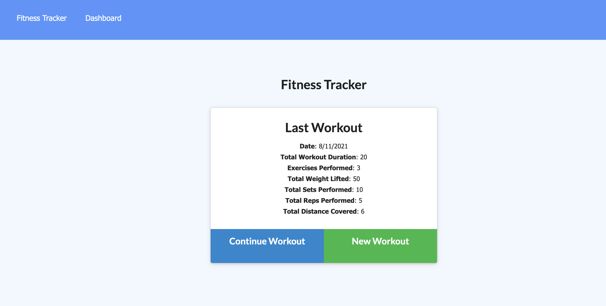
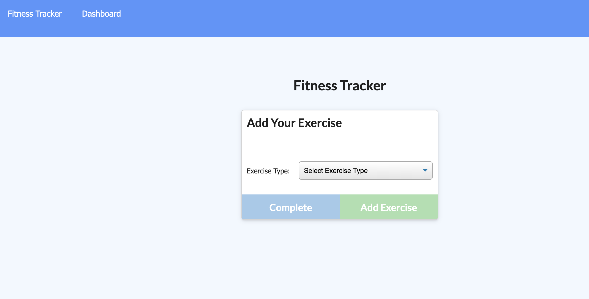
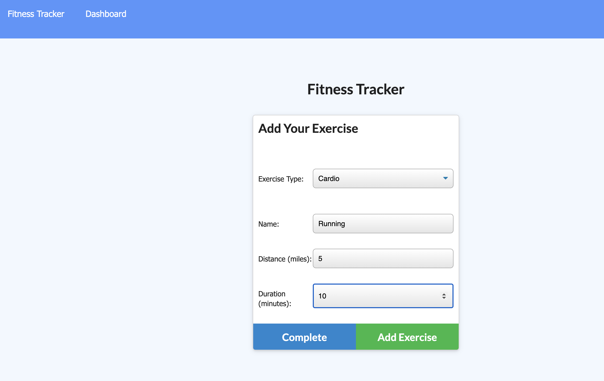
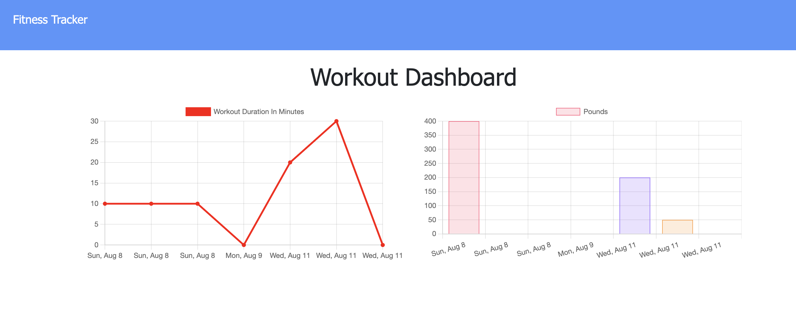

# Workout Tracker using NoSQL

## Description
- This is a workout or fitness tracker meant to track the users daily workouts. They are able to view, create and track their daily fitness routine. This application allows the user to log multiple exercises in a workout on a given day. It also allows tracking of the name, type, weight, sets, reps, and duration of exercise. If the cardio option is chosen, the user can track the distance traveled. 
- A Mongo database was created with a Mongoose schema and handle routes with Express for application functionality.

  ## Table of Contents
  * [Installation](#installation)
  * [Usage](#usage)
  * [License](#license)

## Deployed Application
https://obscure-headland-97370.herokuapp.com/
## Installation

The app is deployed and setup using Heroku.
## Usage

- View create and track daily workouts.
- Log multiple exercises in a workout on a given day. 
- Track the name, type, weight, sets, reps, and duration of exercise. 
- If the exercise is a cardio exercise, it will track the distance traveled.

## Screenshots

## Credits

This app uses the following libraries and modules: 

* Express
* Mongoose
* Express.Router
* Compass for viewing the database

## License
Copyright 2021 Diana L. Daghlas

